# 🏗️ RBAC + Active Directory + Monitoring Architecture

## 📋 Overview

Uitbreiding van het huidige HR Portal systeem met:
- **Active Directory** authenticatie (geen IAM users - school requirement)
- **RBAC** op basis van AD groups
- **Prometheus + Grafana** monitoring voor workspaces

---

## 🌐 AWS Network Architecture

```mermaid
%%{init: {'theme':'dark', 'themeVariables': { 'primaryColor':'#00ff41','primaryTextColor':'#00ff41','primaryBorderColor':'#00ff41','lineColor':'#00d9ff','secondaryColor':'#ff00ff','tertiaryColor':'#ffff00','background':'#0d1117','mainBkg':'#161b22','secondBkg':'#1c2128','border1':'#30363d','border2':'#21262d'}}}%%
graph TB
    subgraph Internet["🌍 Internet"]
        VPN_Client["👤 VPN Client<br/>OpenVPN GUI"]
    end

    subgraph VPC["AWS VPC 10.0.0.0/16"]
        subgraph Public["Public Subnets"]
            OpenVPN["🔐 OpenVPN Server<br/>10.0.15.103<br/>dnsmasq + Route53 forward"]
            NAT["🌐 NAT Instance<br/>10.0.3.244"]
        end

        subgraph Private_A["Private Subnet A"]
            AD_Primary["📁 AWS Managed AD<br/>Primary DC<br/>10.0.49.X<br/>LDAP: 389/636"]
            EKS_Node1["⚙️ EKS Node 1<br/>10.0.51.137"]
        end

        subgraph Private_B["Private Subnet B"]
            AD_Secondary["📁 AWS Managed AD<br/>Secondary DC<br/>10.0.70.X<br/>LDAP: 389/636"]
            EKS_Node2["⚙️ EKS Node 2<br/>10.0.68.112"]
        end

        subgraph Private_C["Private Subnet C"]
            EKS_Node3["⚙️ EKS Node 3<br/>10.0.83.236"]
        end

        subgraph Route53["Route53 Private Zone"]
            DNS_Zone["innovatech.local<br/>Resolver Endpoints<br/>10.0.49.240, 10.0.70.88"]
        end
    end

    VPN_Client -->|OpenVPN 1194| OpenVPN
    OpenVPN -->|DNS Queries| DNS_Zone
    OpenVPN -.->|Tunnel 10.8.0.0/24| EKS_Node1
    OpenVPN -.->|Tunnel 10.8.0.0/24| EKS_Node2
    OpenVPN -.->|Tunnel 10.8.0.0/24| EKS_Node3
    
    EKS_Node1 -->|LDAP Auth| AD_Primary
    EKS_Node2 -->|LDAP Auth| AD_Secondary
    EKS_Node3 -->|LDAP Auth| AD_Primary
    
    EKS_Node1 -.->|Internet via| NAT
    EKS_Node2 -.->|Internet via| NAT
    EKS_Node3 -.->|Internet via| NAT

    style VPC fill:#1c2128,stroke:#00ff41,stroke-width:3px
    style Public fill:#2d333b,stroke:#00d9ff,stroke-width:2px
    style Private_A fill:#2d333b,stroke:#00d9ff,stroke-width:2px
    style Private_B fill:#2d333b,stroke:#00d9ff,stroke-width:2px
    style Private_C fill:#2d333b,stroke:#00d9ff,stroke-width:2px
    style OpenVPN fill:#ff00ff,stroke:#ff00ff,stroke-width:2px,color:#fff
    style NAT fill:#ff00ff,stroke:#ff00ff,stroke-width:2px,color:#fff
    style AD_Primary fill:#ffff00,stroke:#ffff00,stroke-width:2px,color:#000
    style AD_Secondary fill:#ffff00,stroke:#ffff00,stroke-width:2px,color:#000
    style EKS_Node1 fill:#00d9ff,stroke:#00d9ff,stroke-width:2px,color:#000
    style EKS_Node2 fill:#00d9ff,stroke:#00d9ff,stroke-width:2px,color:#000
    style EKS_Node3 fill:#00d9ff,stroke:#00d9ff,stroke-width:2px,color:#000
    style DNS_Zone fill:#00ff41,stroke:#00ff41,stroke-width:2px,color:#000
```

---

## 🏢 Active Directory Structure

```mermaid
%%{init: {'theme':'dark', 'themeVariables': { 'primaryColor':'#00ff41','primaryTextColor':'#00ff41','primaryBorderColor':'#00ff41','lineColor':'#00d9ff','secondaryColor':'#ff00ff','tertiaryColor':'#ffff00'}}}%%
graph TD
    Domain["🏢 Domain: innovatech.local"]
    
    Domain --> Innovatech["📂 OU: Innovatech"]
    
    Innovatech --> Groups["📂 OU: Groups"]
    Innovatech --> Users["📂 OU: Users"]
    
    Groups --> HR_Admins["👥 HR-Admins<br/>Full employee + workspace access"]
    Groups --> IT_Admins["👥 IT-Admins<br/>Workspace + monitoring access"]
    Groups --> Dept_Mgrs["👥 Dept-Managers<br/>Read-only access"]
    Groups --> Engineering["👥 Engineering<br/>Read-only access"]
    
    Users --> Jan["👤 jan.ijder<br/>Member: IT-Admins, Engineering"]
    Users --> Lisa["👤 lisa.bakker<br/>Member: HR-Admins"]
    Users --> Peter["👤 peter.jansen<br/>Member: Engineering"]

    style Domain fill:#ffff00,stroke:#ffff00,stroke-width:3px,color:#000
    style Innovatech fill:#00ff41,stroke:#00ff41,stroke-width:2px,color:#000
    style Groups fill:#00d9ff,stroke:#00d9ff,stroke-width:2px,color:#000
    style Users fill:#00d9ff,stroke:#00d9ff,stroke-width:2px,color:#000
    style HR_Admins fill:#ff00ff,stroke:#ff00ff,stroke-width:2px,color:#fff
    style IT_Admins fill:#ff00ff,stroke:#ff00ff,stroke-width:2px,color:#fff
    style Dept_Mgrs fill:#ff00ff,stroke:#ff00ff,stroke-width:2px,color:#fff
    style Engineering fill:#ff00ff,stroke:#ff00ff,stroke-width:2px,color:#fff
```

---

## 🎯 EKS Cluster Components

```mermaid
%%{init: {'theme':'dark', 'themeVariables': { 'primaryColor':'#00ff41','primaryTextColor':'#00ff41','primaryBorderColor':'#00ff41','lineColor':'#00d9ff','secondaryColor':'#ff00ff','tertiaryColor':'#ffff00'}}}%%
graph TB
    subgraph EKS["EKS Cluster: innovatech-employee-lifecycle"]
        
        subgraph NS_HR["Namespace: hr-portal"]
            Backend["🖥️ HR Portal Backend<br/>NodePort: 30080<br/><br/>+ LDAP Client (ldapjs)<br/>+ RBAC Middleware<br/>+ JWT with AD groups"]
            Frontend["🌐 HR Portal Frontend<br/><br/>+ Role-based UI<br/>+ Conditional rendering<br/>+ Embedded Grafana"]
        end
        
        subgraph NS_Mon["Namespace: monitoring"]
            Prometheus["📊 Prometheus<br/>NodePort: 30090<br/><br/>Scrapes:<br/>- Workspace pods<br/>- Node metrics<br/>- kube-state-metrics"]
            Grafana["📈 Grafana<br/>NodePort: 30030<br/><br/>+ Prometheus datasource<br/>+ Workspace dashboard<br/>+ Anonymous embed mode"]
        end
        
        subgraph NS_WS["Namespace: workspaces"]
            WS1["🖥️ workspace-abc123<br/>kasmweb/desktop:1.14.0<br/>Exposed metrics"]
            WS2["🖥️ workspace-def456<br/>kasmweb/desktop:1.14.0<br/>Exposed metrics"]
            WS3["🖥️ workspace-ghi789<br/>kasmweb/desktop:1.14.0<br/>Exposed metrics"]
        end
    end

    Backend -->|LDAP Queries| AD[("📁 AWS Managed AD<br/>10.0.49.X / 10.0.70.X")]
    Prometheus -->|Scrape /metrics| WS1
    Prometheus -->|Scrape /metrics| WS2
    Prometheus -->|Scrape /metrics| WS3
    Grafana -->|Query| Prometheus
    Frontend -->|Embed iframe| Grafana

    style EKS fill:#1c2128,stroke:#00ff41,stroke-width:3px
    style NS_HR fill:#2d333b,stroke:#00d9ff,stroke-width:2px
    style NS_Mon fill:#2d333b,stroke:#ff00ff,stroke-width:2px
    style NS_WS fill:#2d333b,stroke:#ffff00,stroke-width:2px
    style Backend fill:#00d9ff,stroke:#00d9ff,stroke-width:2px,color:#000
    style Frontend fill:#00d9ff,stroke:#00d9ff,stroke-width:2px,color:#000
    style Prometheus fill:#ff00ff,stroke:#ff00ff,stroke-width:2px,color:#fff
    style Grafana fill:#ff00ff,stroke:#ff00ff,stroke-width:2px,color:#fff
    style WS1 fill:#ffff00,stroke:#ffff00,stroke-width:2px,color:#000
    style WS2 fill:#ffff00,stroke:#ffff00,stroke-width:2px,color:#000
    style WS3 fill:#ffff00,stroke:#ffff00,stroke-width:2px,color:#000
    style AD fill:#00ff41,stroke:#00ff41,stroke-width:2px,color:#000
```

---

## 🔐 Authentication Flow

```mermaid
%%{init: {'theme':'dark', 'themeVariables': { 'primaryColor':'#00ff41','primaryTextColor':'#00ff41','primaryBorderColor':'#00ff41','lineColor':'#00d9ff','secondaryColor':'#ff00ff','tertiaryColor':'#ffff00'}}}%%
sequenceDiagram
    participant User as 👤 User<br/>(jan.ijder)
    participant Frontend as 🌐 Frontend
    participant Backend as 🖥️ Backend
    participant LDAP as 📁 AD LDAP
    participant JWT as 🎫 JWT Service

    User->>Frontend: 1. Open HR Portal
    Frontend->>User: 2. Show login form
    User->>Frontend: 3. Enter: jan.ijder + password
    Frontend->>Backend: 4. POST /api/auth/login
    
    Backend->>LDAP: 5. LDAP Bind (authenticate)
    LDAP-->>Backend: 6. ✅ Auth success
    
    Backend->>LDAP: 7. Get user groups (memberOf)
    LDAP-->>Backend: 8. ["IT-Admins", "Engineering"]
    
    Backend->>JWT: 9. Create JWT with groups
    JWT-->>Backend: 10. Signed token
    Backend-->>Frontend: 11. Return JWT
    
    Frontend->>Frontend: 12. Store JWT + decode groups
    Frontend->>User: 13. Render UI based on groups<br/>✅ Provision Workspace button<br/>✅ Monitoring tab<br/>❌ Add Employee button

    Note over User,JWT: User now authenticated with AD groups
```

---

## 🛡️ RBAC Permission Flow

```mermaid
%%{init: {'theme':'dark', 'themeVariables': { 'primaryColor':'#00ff41','primaryTextColor':'#00ff41','primaryBorderColor':'#00ff41','lineColor':'#00d9ff','secondaryColor':'#ff00ff','tertiaryColor':'#ffff00'}}}%%
sequenceDiagram
    participant User as 👤 Jan (IT-Admin)
    participant Frontend as 🌐 Frontend
    participant Backend as 🖥️ Backend
    participant RBAC as 🛡️ RBAC Middleware
    participant K8s as ⚙️ Kubernetes

    User->>Frontend: 1. Click "Provision Workspace"
    Frontend->>Frontend: 2. Check: user.groups includes IT-Admins? ✅
    Frontend->>Backend: 3. POST /api/workspaces/provision<br/>Authorization: Bearer JWT
    
    Backend->>RBAC: 4. requirePermission('workspaces', 'create')
    RBAC->>RBAC: 5. Extract groups from JWT:<br/>["IT-Admins", "Engineering"]
    RBAC->>RBAC: 6. Check permissions:<br/>IT-Admins → workspaces:create ✅
    RBAC-->>Backend: 7. ✅ Authorized
    
    Backend->>K8s: 8. Create workspace pod
    K8s-->>Backend: 9. Pod created
    Backend-->>Frontend: 10. Success
    Frontend->>User: 11. Show provisioning status

    Note over User,K8s: Permission granted via AD group membership

    participant User2 as 👤 Peter (Engineering)
    User2->>Frontend: 12. Try "Provision Workspace"
    Frontend->>Frontend: 13. Check: user.groups includes HR/IT-Admins? ❌
    Frontend->>User2: 14. Button disabled/hidden

    Note over User2,Frontend: UI prevents unauthorized actions
```

---

## 📊 Monitoring Flow

```mermaid
%%{init: {'theme':'dark', 'themeVariables': { 'primaryColor':'#00ff41','primaryTextColor':'#00ff41','primaryBorderColor':'#00ff41','lineColor':'#00d9ff','secondaryColor':'#ff00ff','tertiaryColor':'#ffff00'}}}%%
graph LR
    subgraph Workspaces["Workspace Pods"]
        WS1["🖥️ workspace-abc123<br/>CPU: 80%<br/>RAM: 2.1GB"]
        WS2["🖥️ workspace-def456<br/>CPU: 30%<br/>RAM: 1.4GB"]
        WS3["🖥️ workspace-ghi789<br/>CPU: 60%<br/>RAM: 1.8GB"]
    end

    subgraph Monitoring["Monitoring Stack"]
        Prom["📊 Prometheus<br/><br/>Scrapes every 30s<br/>Stores metrics"]
        Graf["📈 Grafana<br/><br/>Visualizes data<br/>Creates dashboards"]
    end

    subgraph Frontend["HR Portal"]
        UI["🌐 Frontend<br/><br/>Monitoring Tab<br/>(IT-Admins only)"]
    end

    WS1 -->|"/metrics"| Prom
    WS2 -->|"/metrics"| Prom
    WS3 -->|"/metrics"| Prom
    
    Prom -->|"PromQL queries"| Graf
    Graf -->|"iframe embed<br/>kiosk mode"| UI

    User["👤 IT Admin Jan"]
    User -->|"Click Monitoring tab"| UI
    UI -->|"Shows live dashboard"| User

    style Workspaces fill:#2d333b,stroke:#ffff00,stroke-width:2px
    style Monitoring fill:#2d333b,stroke:#ff00ff,stroke-width:2px
    style Frontend fill:#2d333b,stroke:#00d9ff,stroke-width:2px
    style WS1 fill:#ffff00,stroke:#ffff00,stroke-width:2px,color:#000
    style WS2 fill:#ffff00,stroke:#ffff00,stroke-width:2px,color:#000
    style WS3 fill:#ffff00,stroke:#ffff00,stroke-width:2px,color:#000
    style Prom fill:#ff00ff,stroke:#ff00ff,stroke-width:2px,color:#fff
    style Graf fill:#ff00ff,stroke:#ff00ff,stroke-width:2px,color:#fff
    style UI fill:#00d9ff,stroke:#00d9ff,stroke-width:2px,color:#000
    style User fill:#00ff41,stroke:#00ff41,stroke-width:2px,color:#000
```

---

## 🔒 Security Groups & Network Rules

| Component | Security Group | Ingress Rules |
|-----------|---------------|---------------|
| **AWS Managed AD** | `sg-ad-ldap` | `389` (LDAP) from EKS nodes `636` (LDAPS) from EKS nodes `53` (DNS) from VPC `88` (Kerberos) from VPC |
| **EKS Nodes** | `sg-0b5e152c6b85fad24` | `30000-32767` (NodePort) from OpenVPN `443` (HTTPS) from VPC |
| **EKS Cluster** | `sg-08aab3141ac1c4622` | `443` (API) from nodes `30000-32767` (NodePort) from OpenVPN |
| **OpenVPN Server** | `sg-openvpn` | `1194` (UDP) from 0.0.0.0/0 `22` (SSH) from bastion |
| **NAT Instance** | `sg-nat` | All traffic from private subnets |

---

## 🎭 User Personas & Permissions

```mermaid
%%{init: {'theme':'dark', 'themeVariables': { 'primaryColor':'#00ff41','primaryTextColor':'#00ff41','primaryBorderColor':'#00ff41','lineColor':'#00d9ff','secondaryColor':'#ff00ff','tertiaryColor':'#ffff00'}}}%%
graph TD
    subgraph HR_Admin["👥 HR-Admins (Lisa)"]
        HR_P1["✅ Create/Edit/Delete Employees"]
        HR_P2["✅ Provision Workspaces"]
        HR_P3["✅ Delete Workspaces"]
        HR_P4["❌ View Monitoring"]
    end

    subgraph IT_Admin["👥 IT-Admins (Jan)"]
        IT_P1["❌ Create/Edit Employees"]
        IT_P2["✅ Provision Workspaces"]
        IT_P3["✅ Delete Workspaces"]
        IT_P4["✅ View Monitoring Dashboard"]
        IT_P5["✅ View All Workspace Metrics"]
    end

    subgraph Engineering["👥 Engineering (Peter)"]
        ENG_P1["✅ View Employee List (read-only)"]
        ENG_P2["✅ View Workspace List (read-only)"]
        ENG_P3["❌ Provision Workspaces"]
        ENG_P4["❌ Delete Workspaces"]
        ENG_P5["❌ View Monitoring"]
    end

    style HR_Admin fill:#ff00ff,stroke:#ff00ff,stroke-width:2px,color:#fff
    style IT_Admin fill:#00d9ff,stroke:#00d9ff,stroke-width:2px,color:#000
    style Engineering fill:#ffff00,stroke:#ffff00,stroke-width:2px,color:#000
```

---

## 📦 Component Dependencies

```mermaid
%%{init: {'theme':'dark', 'themeVariables': { 'primaryColor':'#00ff41','primaryTextColor':'#00ff41','primaryBorderColor':'#00ff41','lineColor':'#00d9ff','secondaryColor':'#ff00ff','tertiaryColor':'#ffff00'}}}%%
graph TD
    AD["📁 AWS Managed AD<br/>Domain: innovatech.local"]
    
    Backend["🖥️ HR Portal Backend<br/>+ ldapjs package<br/>+ LDAP service<br/>+ RBAC middleware"]
    
    Frontend["🌐 HR Portal Frontend<br/>+ Role-based rendering<br/>+ Monitoring embed"]
    
    Prometheus["📊 Prometheus<br/>+ ServiceMonitor configs<br/>+ Scrape workspace pods"]
    
    Grafana["📈 Grafana<br/>+ Prometheus datasource<br/>+ Workspace dashboard<br/>+ Anonymous embed"]
    
    Workspaces["🖥️ Workspace Pods<br/>kasmweb/desktop:1.14.0"]

    AD -->|LDAP Auth| Backend
    Backend -->|JWT with groups| Frontend
    Prometheus -->|Scrape metrics| Workspaces
    Grafana -->|Query data| Prometheus
    Frontend -->|Embed iframe| Grafana
    Backend -->|Create pods| Workspaces

    style AD fill:#00ff41,stroke:#00ff41,stroke-width:3px,color:#000
    style Backend fill:#00d9ff,stroke:#00d9ff,stroke-width:2px,color:#000
    style Frontend fill:#00d9ff,stroke:#00d9ff,stroke-width:2px,color:#000
    style Prometheus fill:#ff00ff,stroke:#ff00ff,stroke-width:2px,color:#fff
    style Grafana fill:#ff00ff,stroke:#ff00ff,stroke-width:2px,color:#fff
    style Workspaces fill:#ffff00,stroke:#ffff00,stroke-width:2px,color:#000
```

---

## 🚀 Implementation Phases

### **Phase 1: Active Directory Setup**
- Deploy AWS Managed AD in private subnets
- Configure security groups (LDAP, DNS, Kerberos)
- Create OU structure: Innovatech → Groups, Users
- Create AD groups: HR-Admins, IT-Admins, Dept-Managers, Engineering
- Create test users: jan.ijder, lisa.bakker, peter.jansen
- **Deliverable**: AD accessible via LDAP from EKS nodes

### **Phase 2: Backend LDAP Integration**
- Install `ldapjs` package in backend
- Create LDAP service for authentication & group lookup
- Create RBAC middleware for permission checking
- Update auth routes to use AD instead of hardcoded credentials
- Store AD credentials in Kubernetes Secret
- **Deliverable**: Users can login with AD credentials, JWT contains groups

### **Phase 3: Frontend RBAC UI**
- Implement conditional rendering based on user groups
- Show/hide buttons (Add Employee, Provision Workspace)
- Add role badge in header
- Handle 403 Forbidden errors gracefully
- **Deliverable**: UI adapts to user permissions

### **Phase 4: Prometheus Deployment**
- Create monitoring namespace
- Deploy Prometheus with ServiceMonitor configs
- Configure scraping for workspace pods
- Deploy kube-state-metrics for cluster metrics
- Expose via NodePort (30090)
- **Deliverable**: Metrics collected from all workspaces

### **Phase 5: Grafana Deployment**
- Deploy Grafana in monitoring namespace
- Add Prometheus as datasource
- Create workspace dashboard (CPU, Memory, Network)
- Enable anonymous read-only access
- Expose via NodePort (30030)
- **Deliverable**: Dashboard visible at http://NODE_IP:30030

### **Phase 6: Frontend Monitoring Integration**
- Create Monitoring component with embedded Grafana iframe
- Add Monitoring tab (visible only to IT-Admins)
- Test RBAC: IT-Admins see tab, others don't
- **Deliverable**: Complete integrated monitoring in HR Portal

---

## ✅ Success Criteria

- [x] **Current System**: Employee lifecycle + workspace provisioning working
- [ ] Users authenticate with AD credentials (no IAM users)
- [ ] JWT contains AD groups
- [ ] HR-Admins can CRUD employees + provision workspaces
- [ ] IT-Admins can provision workspaces + view monitoring
- [ ] Engineering users have read-only access
- [ ] Backend enforces RBAC (403 on unauthorized actions)
- [ ] Frontend shows/hides UI elements based on permissions
- [ ] Prometheus scrapes workspace pod metrics
- [ ] Grafana dashboard shows CPU/Memory per workspace
- [ ] Monitoring dashboard embedded in HR Portal (IT-Admins only)

---

## 💰 Cost Impact

| Component | Monthly Cost (Estimate) |
|-----------|------------------------|
| AWS Managed AD (Standard) | ~$40 |
| Prometheus + Grafana (EKS resources) | ~$0 (runs on existing nodes) |
| Additional EKS node capacity (if needed) | ~$30-50 |
| **Total Additional Cost** | **~$70-90/month** |

---

## 🔧 Key Technologies

- **AWS Managed AD**: Enterprise directory service
- **LDAP**: Lightweight Directory Access Protocol
- **ldapjs**: Node.js LDAP client library
- **JWT**: JSON Web Tokens with group claims
- **Prometheus**: Time-series metrics database
- **Grafana**: Metrics visualization platform
- **Kubernetes RBAC**: Native K8s role-based access control

---

## 📝 Notes

- Alle workspace pods blijven draaien als Kasm containers (geen changes nodig)
- EKS cluster blijft zelfde opzet (geen nieuwe clusters)
- OpenVPN + Route53 DNS blijft ongewijzigd
- DynamoDB blijft voor employee/workspace data
- GitHub Actions OIDC blijft voor deployments (geen conflict met AD)
- Service account voor LDAP queries wordt opgeslagen in Kubernetes Secret
- Later optioneel: AD domain-join voor workspace pods (SSO login)