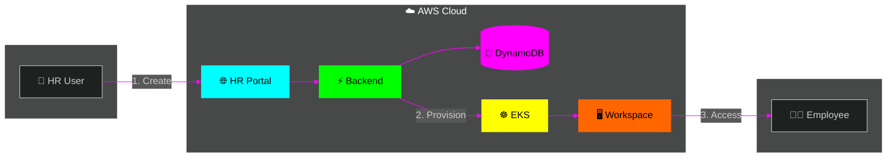
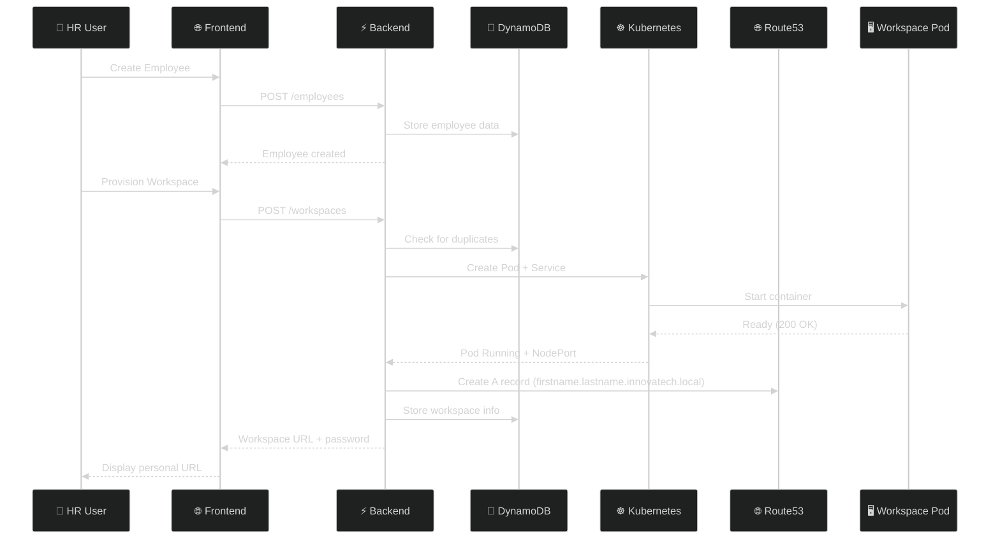
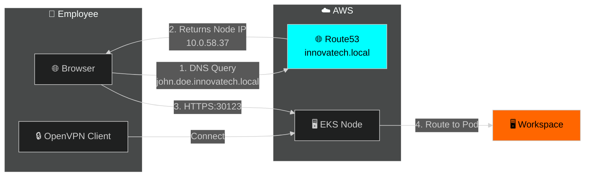
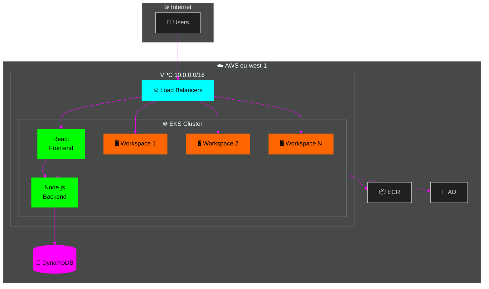
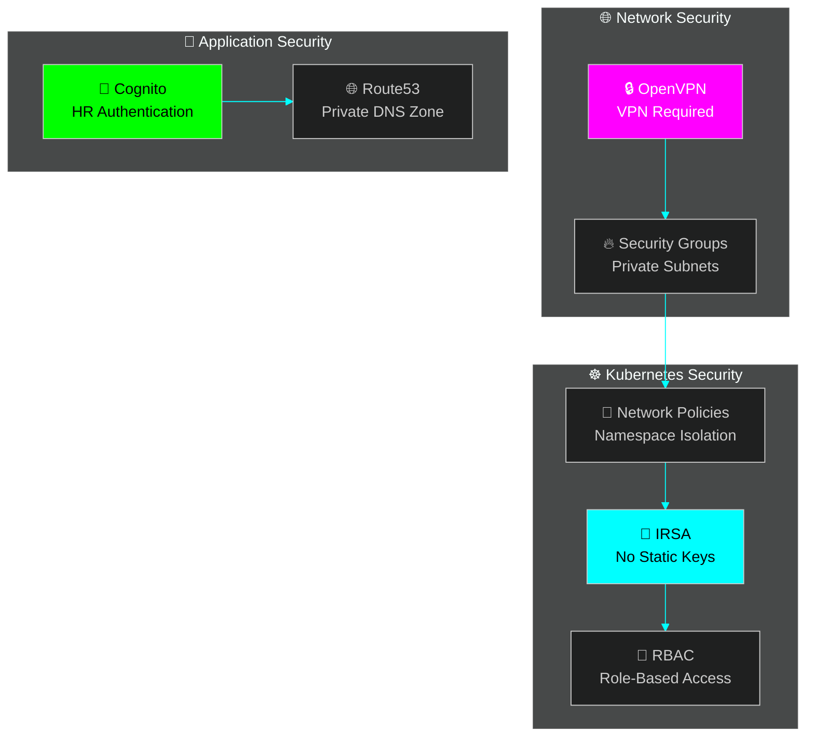
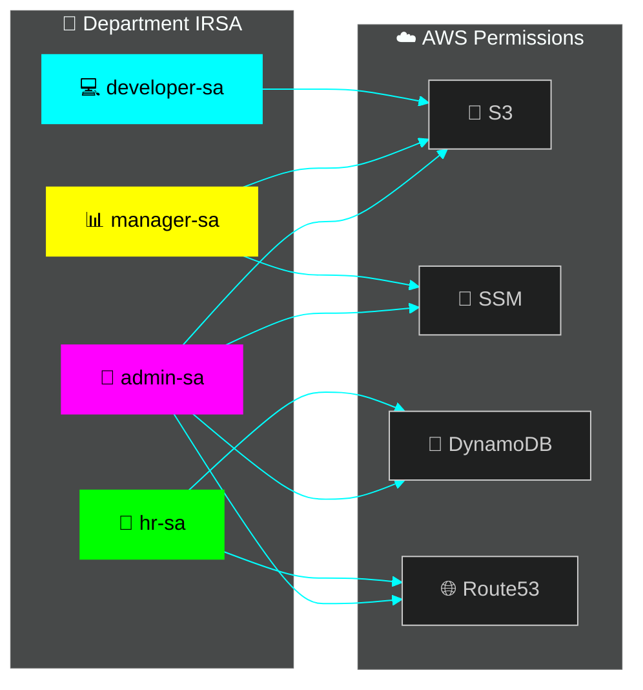

# 🚀 InnovaTech Employee Lifecycle Platform - Release v1.0

> **Automated employee onboarding with cloud-native Linux workspaces**

[](https://aws.amazon.com/eks/)
[](https://kubernetes.io/)
[](https://www.terraform.io/)
[](https://github.com)

**🎉 Release v1.0 - Fully Functional Employee Workspace Platform**

---

## 📋 Overview

A cloud-native HR platform that **automatically provisions Linux desktop workspaces** for new employees. When HR submits employee details, the system creates a containerized Ubuntu desktop accessible via web browser with automatic DNS records.

### ✅ What's Working in v1.0

- ✅ **Complete HR Portal** with employee management
- ✅ **Automated workspace provisioning** (2-5 minute setup)
- ✅ **Automatic DNS records** (`firstname.lastname.innovatech.local`)
- ✅ **VPN access** with OpenVPN + DNS resolution
- ✅ **Real-time provisioning status** with live polling
- ✅ **Official Kasm desktop image** (kasmweb/desktop:1.14.0)
- ✅ **Production-grade timeouts** (10 minutes for workspace startup)
- ✅ **NAT instance** for AWS API access
- ✅ **Route53 private DNS** with resolver endpoints
- ✅ **Custom DNS for HR Portal** (`hr-portal.innovatech.local:30080`)



---

## ⚡ Quick Start

### 🌐 Access Requirements

#### 1️⃣ **VPN Connection** (Required for workspace access)
```
OpenVPN Server: 54.195.44.238
Config: Download from HR Portal or administrator
```

#### 2️⃣ **HR Portal URL** (Public access)
```
http://ac0cd11d903e646dc890a3606c5999df-8a0c923d8bfa6cfe.elb.eu-west-1.amazonaws.com
```

### 📝 Employee Onboarding Workflow

#### **For HR Administrators:**
1. **Login** → HR Portal with Cognito credentials
2. **Create Employee** → Fill in: First Name, Last Name, Email, Department, Role
3. **Provision Workspace** → Click "Provision Workspace" (wait ~2 min)
4. **Share Credentials** → Give employee VPN config + workspace URL + password

#### **For Employees:**
1. **Connect VPN** → Use OpenVPN client with provided config
2. **Access Workspace** → Navigate to personal URL: `https://firstname.lastname.innovatech.local:PORT`
3. **Login** → Use provided password
4. **Work** → Full Ubuntu desktop with Firefox, Terminal, AWS CLI, PuTTY

### 🔗 Personal Workspace URLs

Elke medewerker krijgt een **persoonlijke DNS record** in Route53:
- **Format**: `https://firstname.lastname.innovatech.local:PORT`
- **Voorbeeld**: `https://jan.jansen.innovatech.local:30123`
- **DNS Zone**: Private Hosted Zone `innovatech.local` (Route53)
- **Toegang**: Alleen via VPN (wijst naar EKS node IP in private subnet)
- **Auto-Cleanup**: DNS record wordt verwijderd bij workspace deprovision

Each employee gets a **personal DNS record**:
```
Format: https://{firstname}.{lastname}.innovatech.local:{port}
Example: https://john.doe.innovatech.local:30123

✅ Automatic DNS record creation in Route53
✅ No more localhost:6901 port-forwards
✅ Production-ready URLs
✅ Automatic cleanup on deprovision
```

---

## 🏗️ Architecture

📖 **Detailed docs**: [docs/ARCHITECTURE.md](docs/ARCHITECTURE.md)

### 🔄 Workspace Provisioning Flow



### 🔐 DNS-Based Access Control





---

## 🖥️ Workspace Features

| Tool | Description |
|------|-------------|
| 🐧 **Ubuntu 22.04** | Linux desktop via browser |
| 🖼️ **XFCE** | Lightweight desktop |
| 🌐 **Firefox** | Web browser |
| 💻 **Terminal** | xfce4-terminal |
| 🔒 **PuTTY** | SSH client |
| ☁️ **AWS CLI** | Cloud access (IRSA) |

---

## 🔐 Security Model

### 🛡️ Multi-Layer Security



### 📋 Department-Based Permissions (IRSA)



### ✅ Security Features

| Feature | Status | Description |
|---------|--------|-------------|
| **VPN Access** | ✅ | OpenVPN required for workspace access |
| **Private DNS** | ✅ | Route53 Private Hosted Zone (innovatech.local) |
| **IRSA** | ✅ | No static credentials in containers |
| **Network Policies** | ✅ | Namespace isolation in Kubernetes |
| **Private Subnets** | ✅ | All pods in private subnets (10.0.64.0/19, 10.0.96.0/19) |
| **Cognito Auth** | ✅ | HR Portal authentication |
| **AD Integration** | ⚠️ | Ready (innovatech.local) - Not yet in use |
| **Duplicate Prevention** | ✅ | Backend checks prevent multiple workspaces per employee |

---

## 📁 Project Structure

```
📦 casestudy3
├── 📂 applications/
│   ├── 📂 hr-portal/          # React + Node.js
│   └── 📂 workspace/          # Ubuntu desktop container
├── 📂 kubernetes/             # K8s manifests
├── 📂 terraform/              # AWS infrastructure (IaC)
├── 📂 .github/workflows/      # CI/CD pipeline
└── 📂 docs/                   # Documentation
```

---

## 🛠️ Tech Stack

| Layer | Technology |
|-------|------------|
| ☁️ **Cloud** | AWS (EKS, DynamoDB, ECR, VPC) |
| 🏗️ **IaC** | Terraform |
| 🐳 **Container** | Docker, Kubernetes |
| ⚡ **Backend** | Node.js, Express |
| 🎨 **Frontend** | React |
| 🖥️ **Desktop** | Ubuntu, XFCE, TigerVNC, noVNC |
| 🔄 **CI/CD** | GitHub Actions |

---

## 📊 AWS Resources

| Resource | Value |
|----------|-------|
| **EKS Cluster** | `innovatech-employee-lifecycle` |
| **Region** | `eu-west-1` (Ireland) |
| **VPC** | `10.0.0.0/16` |
| **Directory** | `innovatech.local` |

---

<p align="center">
  <sub>☁️ AWS • ☸️ Kubernetes • 🐳 Docker • 🎓 Fontys S3 2025</sub>
</p>