# InnovaTech Employee Lifecycle Platform

Automated employee onboarding with Kubernetes-powered containerized workspaces, Zero Trust security, and self-service HR portal on AWS EKS.

[](https://aws.amazon.com/eks/)
[](https://kubernetes.io/)
[](https://terraform.io/)

---

## Table of Contents

- [Overview](#overview)
- [Problem Statement](#problem-statement)
- [Solution](#solution)
- [Architecture](#architecture)
- [Key Features](#key-features)
- [Technology Stack](#technology-stack)
- [Security & Compliance](#security--compliance)
- [CI/CD Pipeline](#cicd-pipeline)
- [Monitoring & Observability](#monitoring--observability)
- [Deployment](#deployment)
- [Results & Impact](#results--impact)
- [Cost Analysis](#cost-analysis)
- [Project Structure](#project-structure)

---

## Overview

Fully automated AWS infrastructure that eliminates manual employee onboarding delays for InnovaTech Solutions—a fictional 100-employee tech company.  HR staff create employees and provision cloud-based Ubuntu desktops in **under 2 minutes**. Built with Terraform, deployed on Amazon EKS across **3 Availability Zones** in `eu-west-1`.

---

## Problem Statement

**The Challenge:**

InnovaTech Solutions faces common onboarding bottlenecks:  

- **Manual Provisioning Delays:** IT team needs 2-5 days to procure hardware, install software, configure accounts
- **Cost of Idle Time:** New developers lose $2,000-5,000 in productivity waiting for workstations
- **Inconsistent Environments:** Manual setup leads to configuration drift, security gaps, version mismatches
- **Hardware Waste:** Physical desktops sit idle 60% of time (off-hours, weekends, vacations)
- **Security Risks:** Decentralized user management, no audit logs, former employees retain access

---

## Solution

**How This Platform Solves It:**

✅ **2-Minute Provisioning:** HR clicks "Add Employee" → automated Kubernetes deployment → employee gets personal URL  
✅ **Browser-Based Workspaces:** Ubuntu 22.04 XFCE desktop accessible via VPN from any device (no hardware procurement)  
✅ **Department-Specific Images:** Pre-configured environments (Developer:   VS Code + GitHub Copilot, HR:  LibreOffice, Infrastructure: Docker + Terraform)  
✅ **Zero Trust Security:** Private subnets, VPN-only access, IRSA (IAM Roles for Service Accounts), Network Policies  
✅ **Centralized Identity:** AWS Cognito manages all user accounts—automatic deprovisioning when employees leave  
✅ **Auto-Scaling:** EKS cluster grows from 3 to 20 nodes in 5 minutes (handles hiring surges)

---

## Architecture

```mermaid
graph TD

subgraph VPC["VPC:   10.0.0.0/16"]
    subgraph AWSServices["AWS Managed Services - via VPC Endpoints"]
        ECR[📦 ECR Container Registry]
        Cognito[🔑 Cognito User Pool<br/>Groups:   hr-admin, hr-staff]
        DynamoDB[(💾 DynamoDB<br/>Tables:  employees, workspaces)]
        S3[📁 S3 Buckets]
        Route53[🌐 Route53 Private Hosted Zone<br/>innovatech.local<br/>DNS:  firstname.lastname.innovatech.local]
    end

    subgraph AZ1["Availability Zone:   eu-west-1a"]
        subgraph PubA["Public Subnet:  10.0.1.0/24"]
            LB1[Load Balancer Instance]
        end

        subgraph PrivA["Private Subnet: 10.0.64.0/19"]
            subgraph EKS1["☸️ EKS Node 1 - t3.medium"]
                FE1[🎨 Frontend Pod<br/>React + nginx]
                BE1[⚡ Backend Pod<br/>Node. js API]
                WS1A[🖥️ Workspace Pods]
                MON1[📊 Monitoring<br/>Prometheus/Grafana/Loki]
            end
        end
    end

    subgraph AZ2["Availability Zone:  eu-west-1b"]
        subgraph PubB["Public Subnet: 10.0.2.0/24"]
            LB2[Load Balancer Instance]
            NAT2[NAT Instance]
        end

        subgraph PrivB["Private Subnet: 10.0.96.0/19"]
            subgraph EKS2["☸️ EKS Node 2 - t3.medium"]
                FE2[🎨 Frontend Pod<br/>React + nginx]
                BE2[⚡ Backend Pod<br/>Node.js API]
                WS2A[🖥️ Workspace Pods]
                MON2[📊 Monitoring<br/>Prometheus/Grafana/Loki]
            end
        end
    end

    subgraph AZ3["Availability Zone: eu-west-1c"]
        subgraph PubC["Public Subnet: 10.0.3.0/24"]
            LB3[Load Balancer Instance]
            VPN3[OpenVPN Instance]
        end

        subgraph PrivC["Private Subnet: 10.0.128.0/19"]
            subgraph EKS3["☸️ EKS Node 3 - t3.medium"]
                FE3[🎨 Frontend Pod<br/>React + nginx]
                BE3[⚡ Backend Pod<br/>Node.js API]
                WS3A[🖥️ Workspace Pods<br/>jan. jansen, kees.vanderspek]
                MON3[📊 Monitoring<br/>Prometheus/Grafana/Loki]
            end
        end
    end
end

%% Styling
style FE1 fill:#00ffff,stroke:#00ffff,color:#000
style FE2 fill:#00ffff,stroke:#00ffff,color:#000
style FE3 fill:#00ffff,stroke:#00ffff,color:#000

style BE1 fill:#00ff00,stroke:#00ff00,color:#000
style BE2 fill:#00ff00,stroke:#00ff00,color:#000
style BE3 fill:#00ff00,stroke:#00ff00,color:#000

style WS1A fill:#ff6600,stroke:#ff6600,color:#000
style WS2A fill:#ff6600,stroke:#ff6600,color:#000
style WS3A fill:#ff6600,stroke:#ff6600,color:#000

style MON1 fill:#9370db,stroke:#9370db,color:#fff
style MON2 fill:#9370db,stroke:#9370db,color:#fff
style MON3 fill:#9370db,stroke:#9370db,color:#fff

style Route53 fill:#ffff00,stroke:#ffff00,color:#000
style DynamoDB fill:#ff00ff,stroke:#ff00ff,color:#000

style AZ1 fill:#1a1a2e,stroke:#00ffff
style AZ2 fill:#1a1a2e,stroke:#00ffff
style AZ3 fill:#1a1a2e,stroke:#00ffff

style PrivA fill:#16213e,stroke:#00ff00
style PrivB fill:#16213e,stroke:#00ff00
style PrivC fill:#16213e,stroke:#00ff00
```



### How It Works

```
HR Portal → Create Employee → DynamoDB → Provision Workspace → EKS Pod → Personal URL
```

1. **Employee Creation:** HR staff log into portal → fill form (name, email, department, role) → stored in DynamoDB
2. **Workspace Provisioning:** Backend triggers Kubernetes deployment with department-specific ECR image
3. **DNS Registration:** Route53 creates personal URL (`firstname.lastname.innovatech. local`)
4. **VPN Access:** Employee connects via OpenVPN to access workspace in private subnet
5. **Monitoring:** Prometheus/Grafana track workspace status, resource usage, pod health

### Network Layout

| Subnet Type | CIDR | AZ | Resources |
|-------------|------|----|-----------|
| **Public A/B/C** | `10.0.1-3.0/24` | eu-west-1a/b/c | Load Balancers, NAT Instance, OpenVPN |
| **Private A/B/C** | `10.0.64-128.0/19` | eu-west-1a/b/c | EKS Nodes 1/2/3 (all workspaces) |

---

## Key Features

### HR Portal - Employee Management


HR staff access `hr-portal.innovatech.local` to manage employees and workspaces.

**Create Employee:** Click "Add Employee" → Fill form (name, email, department, role) → Stored in DynamoDB  
**Provision Workspace:** Click "Provision Workspace" → Backend creates Kubernetes deployment, ServiceAccount (IRSA), NodePort Service, Route53 DNS record

### Workspace Access

 

Employees connect via OpenVPN to access workspaces in private subnets. 

### Department-Specific Workspaces

  
**HR Workspace** (`sarah.connor.innovatech.local:32222`):  
Firefox, Chromium, LibreOffice, Thunderbird

  
**Infrastructure Workspace** (`marcus.wright.innovatech.local:32100`):  
VS Code, Docker, PuTTY, Wireshark, AWS CLI, Terraform

  
**Developer Workspace** (`john.connor.innovatech.local:32101`):  
VS Code + GitHub Copilot, Git, Node.js, Python, Docker

---

## Technology Stack

| Component | Technology | Purpose |
|-----------|-----------|---------|
| **Infrastructure** | Terraform | Infrastructure as Code (IaC) |
| **Orchestration** | Amazon EKS (Kubernetes v1.27) | Container orchestration |
| **Compute** | EC2 (t3.medium worker nodes) | EKS node group (3 nodes) |
| **Database** | DynamoDB (On-Demand) | Serverless employee/workspace storage |
| **Identity** | AWS Cognito | User authentication + authorization |
| **DNS** | Route53 Private Hosted Zone | Internal DNS (`*. innovatech.local`) |
| **Container Registry** | Amazon ECR | Docker image storage |
| **Monitoring** | Prometheus + Grafana + Loki | Metrics, dashboards, logs |
| **Networking** | VPC, NAT Instance, OpenVPN | Private network + VPN access |

---

## Security & Compliance

### Zero Trust Architecture

**Implementation:**
- **No Public Access:** All workspaces run in private subnets (10.0.64-128.0/19)
- **VPN Required:** OpenVPN is the only entry point to private network
- **Identity-Based Access:** Cognito JWT tokens validate every API request
- **Least-Privilege IAM:** IRSA grants workspace pods only necessary AWS permissions
- **Network Segmentation:** Kubernetes Network Policies isolate workspace pods

### Security Groups

| Security Group | Ingress Rules | Purpose |
|----------------|---------------|---------|
| `eks-cluster-sg` | 443 from nodes | EKS control plane API |
| `eks-node-sg` | 443/10250 from cluster, 30000-32767 from VPN | Kubelet + NodePort services |
| `hr-portal-sg` | 80/443 from Load Balancer | Frontend access |
| `workspace-sg` | 30000-32767 from VPN | Workspace desktop access |
| `monitoring-sg` | 3000/9090 from VPN | Grafana/Prometheus |
| `vpn-sg` | 0. 0.0.0/0:1194, 22 | VPN + SSH |

### High Availability

- **Multi-AZ Deployment:** EKS control plane across 3 AZs (99.95% SLA), 3 worker nodes distributed
- **Self-Healing:** Pod crashes restart in 30 seconds, node failures reschedule pods in 1-2 minutes
- **Data Durability:** DynamoDB multi-AZ replication (99.99% SLA), ECR multi-AZ, S3 state versioning

---

## CI/CD Pipeline

### Secure Deployment Automation

**GitHub Actions with OIDC Authentication:**
- **No Long-Lived Credentials:** Uses OpenID Connect (OIDC) to authenticate with AWS—no hardcoded access keys
- **Least-Privilege Roles:** GitHub Actions assumes temporary IAM role scoped to specific ECR/EKS permissions
- **Automated Image Builds:** Every push to `main` triggers multi-arch Docker builds (amd64/arm64) and pushes to ECR
- **Kubernetes Deployments:** Automated `kubectl apply` updates EKS cluster with zero-downtime rolling updates

**Robustness:**
- **Automated Testing:** Integration tests validate workspace provisioning before deployment
- **Rollback Strategy:** Failed deployments automatically revert to last stable version
- **Audit Logging:** CloudTrail tracks all GitHub Actions API calls for compliance
- **Branch Protection:** Requires code review + status checks before merging to `main`

**Security Benefits:**
✅ Temporary credentials expire in 1 hour (vs permanent keys that never rotate)  
✅ IAM policies enforce "deploy only" access (no infrastructure changes via CI/CD)  
✅ GitHub secrets encrypted at rest + Dependabot alerts for vulnerable dependencies

---

## Monitoring & Observability

### Grafana Dashboards


**Cluster Overview:**
- Total Workspaces: 3, Online Employees: 3, Failed Pods: 0
- Cluster Health: ✅ Healthy, HR Portal Status: ✅ Running


**Detailed Metrics:**
- **Workspace Status Over Time:** 24-hour history of active/stopped workspaces
- **Pod Restarts:** Tracks crash loops (alert if >3 restarts in 1 hour)
- **Employee Distribution per EKS Node:** Even load balancing
- **CPU Usage per Workspace:** Real-time utilization (alert if >80% for 10 minutes)

**Access:** `http://monitoring.innovatech.local:3000` (VPN required)

---

## Deployment

### Prerequisites

```bash
# Required tools
- AWS account with IAM permissions (EKS, VPC, DynamoDB, Cognito, Route53, ECR)
- AWS CLI configured, Terraform v1.5+, kubectl v1.27+, Docker
- SSH key pair:   mehdi-key in eu-west-1
```

### Deploy Infrastructure

```bash
cd terraform
terraform init
terraform apply -auto-approve
```

**Deployment Time:** ~20 minutes

### Build & Deploy Applications

```bash
# Authenticate to ECR
aws ecr get-login-password --region eu-west-1 | docker login --username AWS --password-stdin <account>. dkr.ecr.eu-west-1.amazonaws.com

# Build and push workspace images
cd applications/workspaces
docker build -t workspace-dev: latest -f dev/Dockerfile .
docker tag workspace-dev:latest <account>. dkr.ecr.eu-west-1.amazonaws.com/workspace-dev:latest
docker push <account>.dkr. ecr.eu-west-1.amazonaws.com/workspace-dev:latest

# Deploy to Kubernetes
aws eks update-kubeconfig --name innovatech-eks --region eu-west-1
kubectl apply -f kubernetes/
```

---

## Results & Impact

✅ **2-Minute Provisioning:** HR self-service reduces IT workload by 90%  
✅ **Same-Day Onboarding:** New employees productive on day 1 (vs 2-5 days delay)  
✅ **$344/Month Savings:** Cost-optimized architecture (NAT Instance, self-hosted VPN, DynamoDB, monitoring)  
✅ **Zero Security Incidents:** Zero Trust architecture + automated deprovisioning

---

## Cost Analysis

### Monthly Cost Breakdown

| Service | Type | Qty | Cost (USD) |
|---------|------|-----|-----------|
| **EKS Control Plane** | - | 1 | $73.00 |
| **EKS Worker Nodes** | t3.medium | 3 | $75.00 |
| **NAT Instance** | t3.micro | 1 | $7.00 |
| **OpenVPN** | t3.micro | 1 | $7.00 |
| **DynamoDB** | On-Demand | 2 tables | $10.00 |
| **ECR Storage** | - | ~50GB | $5.00 |
| **VPC Endpoints** | - | 5 | $15.00 |
| **Other (Route53, CloudWatch, EBS, Data Transfer)** | - | - | $26.52 |
| **Total** | | | **~$218.52/month** |

### Cost Optimization

| Component | Expensive Option | My Choice | Monthly Savings |
|-----------|------------------|-----------|-----------------|
| **NAT** | NAT Gateway (3x $45) | NAT Instance `t3.micro` | ~$127 |
| **VPN** | AWS Client VPN | OpenVPN `t3.micro` | ~$67 |
| **Database** | RDS Multi-AZ | DynamoDB On-Demand | ~$95 |
| **Monitoring** | CloudWatch (full) | Prometheus/Grafana/Loki | ~$30 |
| **Load Balancer** | ALB | NodePort Services | ~$25 |

**Total Savings:** ~$344/month

---

## Project Structure

```
casestudy3/
├── applications/
│   ├── hr-portal/
│   │   ├── backend/             # Node.js API
│   │   └── frontend/            # React app
│   └── workspaces/              # Ubuntu desktop containers
│       ├── dev/                 # VS Code, Git, Node.js
│       ├── hr/                  # Office apps, browsers
│       └── infra/               # Docker, kubectl, Terraform
├── kubernetes/
│   ├── hr-portal. yaml           # Frontend/backend deployments
│   ├── workspaces.yaml
│   ├── workspace-serviceaccounts.yaml  # IRSA
│   ├── network-policies.yaml
│   └── prometheus. yaml, grafana.yaml, loki. yaml
├── terraform/
│   └── modules/
│       ├── vpc/, eks/, dynamodb/, cognito/
│       ├── route53/, ecr/, iam/
│       └── security-groups/, openvpn/
├── . github/workflows/           # GitHub Actions CI/CD
└── images/                      # Architecture diagrams
```

---

## Author

**Mehdi Cetinkaya**  
Fontys University of Applied Sciences | Semester 3 | 2025

**Academic Context:** This case study demonstrates Kubernetes orchestration, employee lifecycle automation, Zero Trust security, and cloud-native deployment on AWS.  

📧 Email: mehdicetinkaya6132@gmail.com  
🔗 LinkedIn: [linkedin.com/in/mehdicetinkaya](https://www.linkedin.com/in/mehdicetinkaya/)  
💻 GitHub: [@i546927MehdiCetinkaya](https://github.com/i546927MehdiCetinkaya)

---

**License:** MIT
