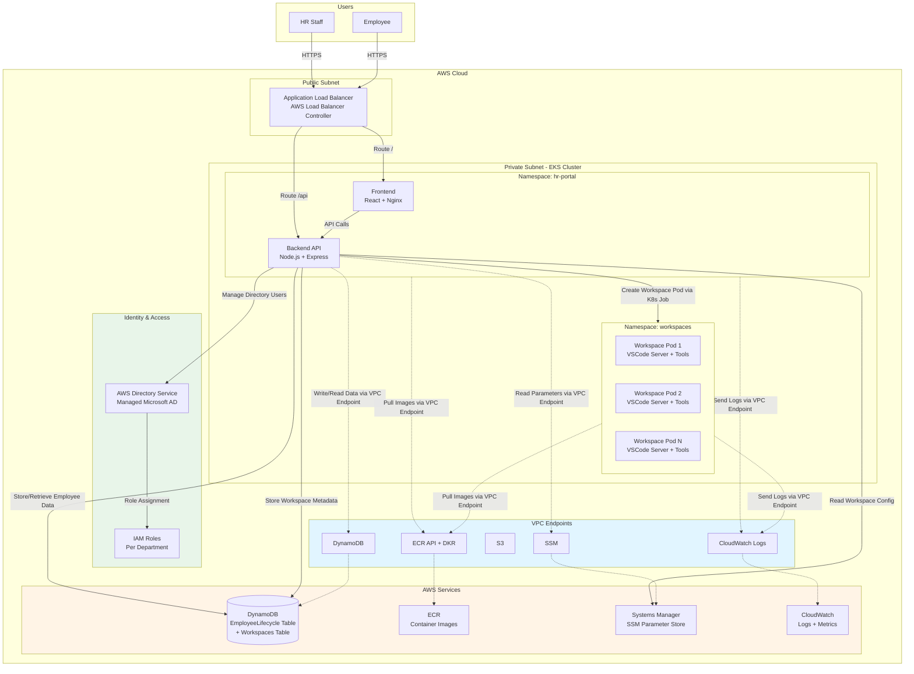
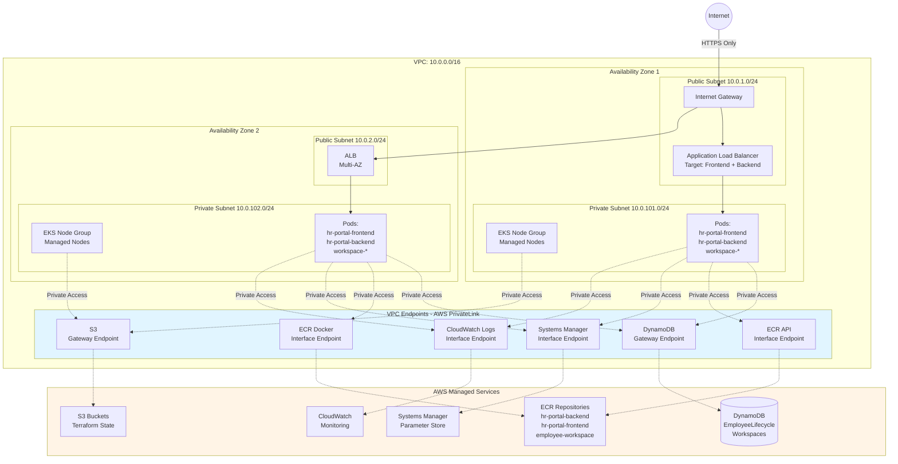
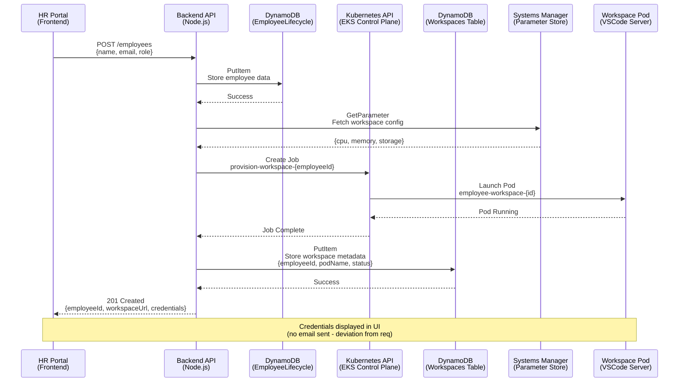

# Architecture

## System Architecture



---

## Identity & Access Management

### IAM Roles Per Department (No IAM Users)

| Role | Department | Key Permissions |
|------|------------|-----------------|
| `infra-role` | IT, DevOps, Infrastructure | EKS describe, EC2 read, CloudWatch, SSM read |
| `developer-role` | Engineering, Development | ECR push/pull, CodeBuild, CloudWatch logs |
| `hr-role` | HR, Human Resources | DynamoDB employee CRUD, workspaces read |
| `manager-role` | Management, Executive | DynamoDB read-only, CloudWatch read |
| `admin-role` | Administration | Full access to all project resources |

### Service Roles (IRSA)

| Role | Service | Purpose |
|------|---------|---------|
| `hr-portal-role` | Backend API | DynamoDB, SSM, Directory Service access |
| `workspace-role` | Workspace Provisioner | CloudWatch logs, workspace management |

**Key Design Decisions:**
- **No IAM Users**: All human access via IAM Roles (school/enterprise requirement)
- **Directory Service**: AWS Managed Microsoft AD for centralized identity
- **Department-based Roles**: Each department has specific, scoped permissions
- **SAML Federation**: Employees assume roles via Directory Service integration
- **IRSA for Services**: Kubernetes pods use IAM Roles for Service Accounts

---

## AWS Network Architecture



**Key Architecture Decisions:**
- **No NAT Gateway**: All AWS service communication via VPC endpoints (cost optimization: ~$32/month savings)
- **No Direct Workspace Access**: Workspaces are backend-managed pods, credentials displayed in HR portal UI
- **Private-Only Pods**: EKS nodes in private subnets, no direct internet access
- **ALB Ingress**: AWS Load Balancer Controller provisions ALB automatically via Kubernetes Ingress

---

## Data Flow



---

## Infrastructure Components

### Terraform Modules

| Module | Purpose | Key Resources |
|--------|---------|---------------|
| **vpc** | Network foundation | VPC, subnets (public/private), IGW, route tables |
| **eks** | Kubernetes cluster | EKS cluster, managed node groups, OIDC provider |
| **dynamodb** | Data storage | EmployeeLifecycle table, Workspaces table |
| **iam** | Access control | Service account roles, IRSA for hr-portal & workspaces |
| **vpc-endpoints** | Private AWS access | ECR, DynamoDB, S3, SSM, CloudWatch endpoints |
| **systems-manager** | Configuration management | SSM parameters for workspace settings |
| **ebs-csi** | Persistent storage | EBS CSI driver for workspace volumes |
| **security-groups** | Network security | EKS cluster, node, pod security groups |
| **ecr** | Container registry | Repositories for frontend, backend, workspace images |
| **monitoring** | Observability | CloudWatch log groups, metric filters, dashboards |

---

## Applications

### HR Portal
- **Frontend**: React SPA served by nginx, containerized
- **Backend**: Node.js Express API with AWS SDK integration
- **Namespace**: `hr-portal`
- **IAM Role**: `hr-portal-sa-role` (IRSA) with DynamoDB, SSM, EKS permissions

### Employee Workspaces
- **Image**: VSCode server + development tools (Git, Docker, Node.js)
- **Provisioning**: Kubernetes Jobs created by backend API
- **Namespace**: `workspaces` (isolated from hr-portal)
- **Storage**: 20GB EBS volumes per workspace via EBS CSI driver
- **Resources**: 2 vCPU, 4GB RAM per pod

---

## Security

### Zero Trust Principles
- **Private Subnets Only**: All pods run without direct internet access
- **VPC Endpoints**: Secure, private communication to AWS services
- **IRSA (IAM Roles for Service Accounts)**: Pod-level AWS permissions via OIDC
- **Network Policies**: Kubernetes namespace isolation
- **RBAC**: Kubernetes role-based access control for service accounts

### Security Groups
| Group | Purpose | Rules |
|-------|---------|-------|
| EKS Cluster SG | Control plane | Ingress from nodes on 443 |
| Node SG | Worker nodes | Ingress from ALB, cluster; egress to VPC endpoints |
| Pod SG | Application pods | Restricted ingress based on namespace |

---

## Scalability

- **EKS Cluster Autoscaler**: Automatically scales node groups based on pod resource requests
- **Horizontal Pod Autoscaler (HPA)**: Scales backend API pods based on CPU/memory
- **DynamoDB On-Demand**: Automatically scales read/write capacity
- **Multi-AZ**: EKS nodes and ALB span 2 availability zones

---

## Monitoring

### CloudWatch Integration
- **Log Groups**: Separate groups for frontend, backend, workspace pods
- **Metrics**: CPU, memory, network for EKS nodes and pods
- **Alarms**: Triggers for pod failures, high error rates, resource exhaustion
- **Dashboards**: Custom dashboard showing:
  - Active employee count
  - Workspace provisioning success rate
  - API response times
  - DynamoDB throttling events

---

## Deployment

### Infrastructure Provisioning
1. **Terraform**: Provisions VPC, EKS, DynamoDB, IAM, VPC endpoints
2. **State Management**: Remote state in S3 with DynamoDB locking
3. **Terraform Modules**: Modular design for reusability

### Application Deployment
1. **Docker**: Build images for frontend, backend, workspace
2. **ECR**: Push images to AWS ECR repositories
3. **Kubernetes Manifests**: Deploy via kubectl:
   - Namespaces
   - Deployments (frontend, backend)
   - Services (ClusterIP for backend, LoadBalancer for frontend)
   - Ingress (ALB via AWS Load Balancer Controller)
   - ServiceAccounts with IRSA annotations

### CI/CD Pipeline
- **GitHub Actions**: Automated on push to `main`
- **Workflow**: Terraform plan → apply → Docker build → ECR push → kubectl apply
- **OIDC Authentication**: GitHub Actions authenticate to AWS without static credentials

---

## Design Deviations from Requirements

### Email Notifications (REQ-NCA-P3-01)
**Requirement**: Automated provisioning with email credentials via AWS SES  
**Implementation**: Credentials displayed in HR Portal UI instead of email  
**Justification**:
- **Simplicity**: No SES configuration, DNS verification, or email templates needed
- **Cost**: Saves SES costs (~$0.10 per 1,000 emails)
- **Security**: Credentials not transmitted via email (reduces interception risk)
- **User Experience**: Immediate access in portal vs. waiting for email delivery
- **Core Requirement Met**: Automated provisioning still occurs, only delivery method differs

### Internet Access Architecture
**Requirement**: None specified  
**Implementation**: No NAT Gateway - all AWS service access via VPC endpoints  
**Justification**:
- **Cost Optimization**: Saves ~$32/month per NAT Gateway (no data transfer charges)
- **Security**: No egress internet access from pods (reduced attack surface)
- **Performance**: VPC endpoints provide faster access to AWS services
- **Zero Trust Alignment**: Private-only communication aligns with ZTA principles

### Workspace Access Pattern
**Requirement**: None specified  
**Implementation**: Workspaces are backend-managed pods, not directly routed via ALB  
**Justification**:
- **Current Phase**: Focus on automated provisioning (Phase 2 core assignment)
- **Future Enhancement**: Workspace routing can be added via Ingress in Phase 3
- **Security**: Prevents direct user access to workspace pods before proper authentication

---

## Cost Optimization

| Resource | Monthly Cost (Estimate) | Optimization |
|----------|------------------------|--------------|
| EKS Cluster | $72 | Required (control plane) |
| EC2 Nodes (3x t3.medium) | ~$90 | Right-sized for workload |
| NAT Gateway | **$0** | ✅ Eliminated via VPC endpoints |
| VPC Endpoints | ~$22 | Required for private access |
| DynamoDB On-Demand | ~$5 | Pay-per-request |
| ALB | ~$16 | Required for ingress |
| **Total** | **~$205/month** | **$32/month saved** vs NAT |

```