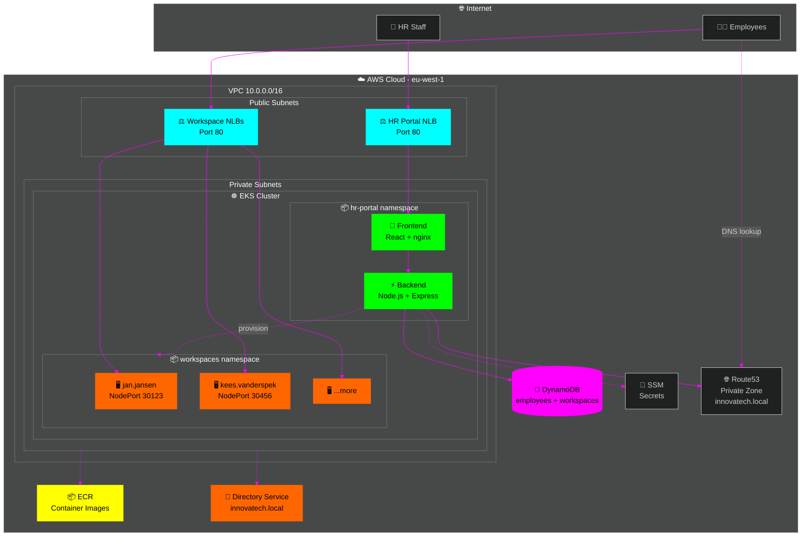
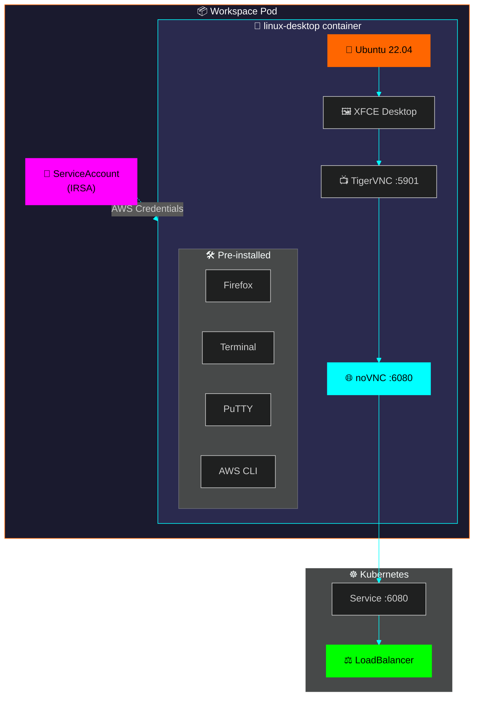
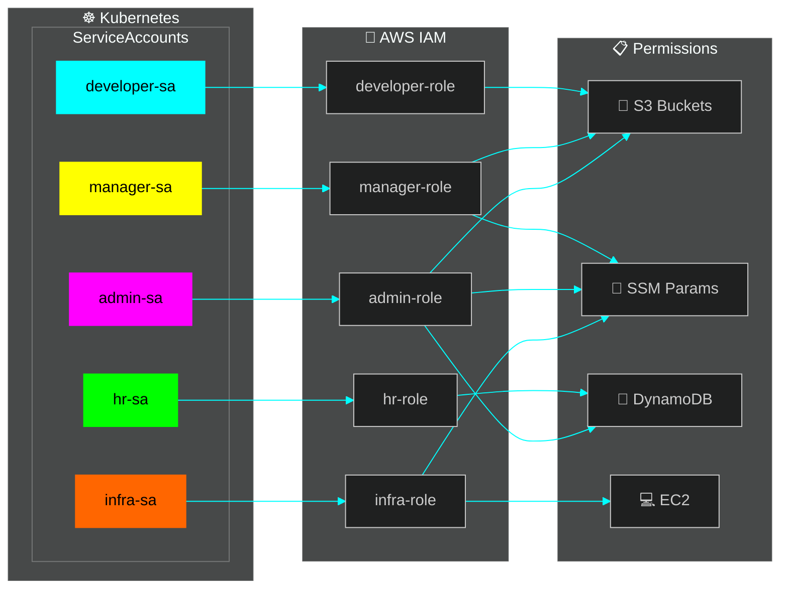
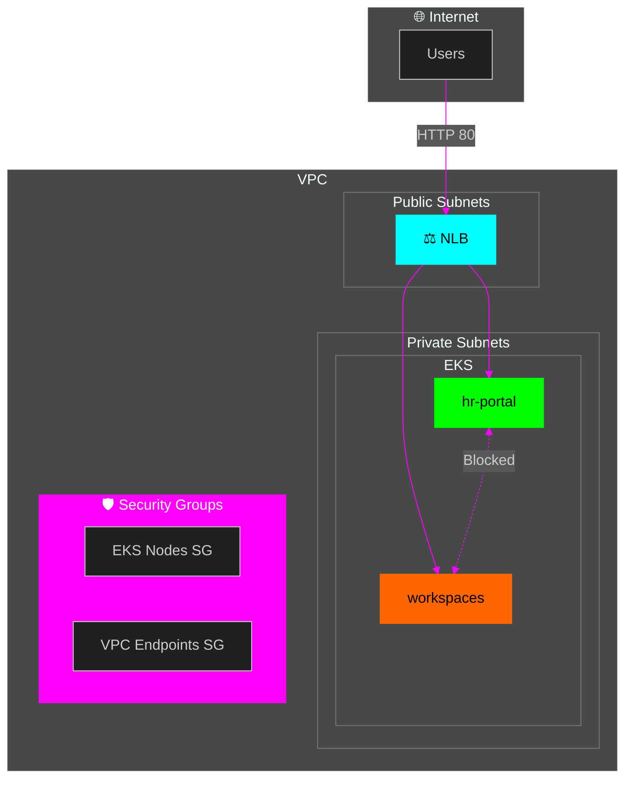
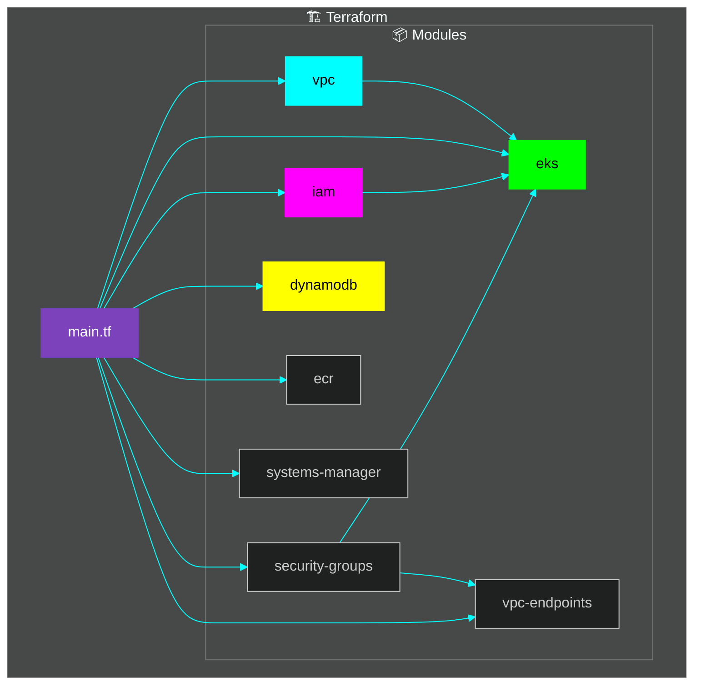
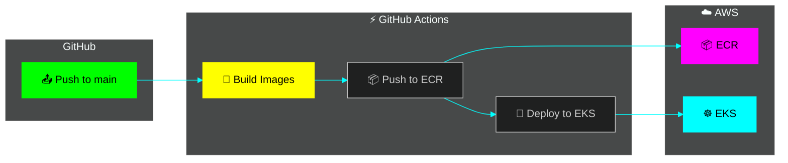
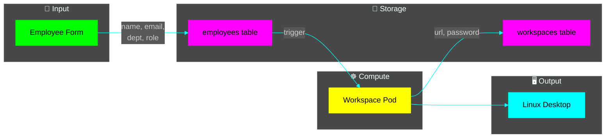

# 🏗️ Architecture

> **InnovaTech Employee Lifecycle Platform** - Technical Architecture

---

## 🌐 High-Level Overview

---

## 🔄 Employee Onboarding Flow

```mermaid
%%{init: {'theme': 'dark', 'themeVariables': { 'primaryColor': '#0f0', 'lineColor': '#0ff'}}}%%
sequenceDiagram
    autonumber
    participant HR as 👤 HR Staff
    participant FE as 🎨 Frontend
    participant BE as ⚡ Backend
    participant DB as 💾 DynamoDB
    participant K8S as ☸️ Kubernetes
    participant WS as 🖥️ Workspace
    participant EMP as 👨‍💻 Employee

    rect rgb(20, 20, 40)
        Note over HR,DB: Employee Creation
        HR->>FE: Create Employee Form
        FE->>BE: POST /api/employees
        BE->>DB: Put Item
        DB-->>BE: ✅ Saved
        BE-->>FE: Employee Created
    end

    rect rgb(40, 20, 40)
        Note over HR,WS: Workspace Provisioning
        HR->>FE: Click "Provision Workspace"
        FE->>BE: POST /api/workspaces
        BE->>DB: Check for duplicate
        BE->>K8S: Create Pod + NodePort Service
        K8S->>WS: Start Container
        WS-->>K8S: Ready (TCP Check)
        K8S-->>BE: NodeIP + NodePort
        BE->>Route53: Create DNS A Record
        Note over Route53: firstname.lastname.innovatech.local → NodeIP
        BE->>DB: Save Workspace + URL
        BE-->>FE: ✅ Workspace Ready
    end

    rect rgb(20, 40, 40)
        Note over EMP,WS: Desktop Access
        Note over EMP: Connect to OpenVPN
        EMP->>Route53: DNS Lookup firstname.lastname.innovatech.local
        Route53-->>EMP: NodeIP (10.0.x.x)
        EMP->>WS: HTTPS via VPN to NodeIP:NodePort
        WS-->>EMP: 🖥️ Ubuntu Desktop via noVNC
    end
```

---

## 🖥️ Workspace Pod Architecture

---

## 🔐 Security Architecture

### IRSA (IAM Roles for Service Accounts)

### Network Security

---

## 🏢 AWS Infrastructure

### Terraform Modules

### Resource Summary

| Resource | Name | Details |
|----------|------|---------|
| 🌐 **VPC** | innovatech-vpc | 10.0.0.0/16, 2 AZs |
| ☸️ **EKS** | innovatech-employee-lifecycle | v1.29, Managed Nodes |
| 💾 **DynamoDB** | employees, workspaces | On-demand capacity |
| 📦 **ECR** | hr-portal-*, workspace | Container registry |
| 🔐 **Directory** | innovatech.local | AWS Managed AD |
| 🔧 **SSM** | /innovatech-*/* | Secrets & config |

---

## 🔄 CI/CD Pipeline

### Pipeline Triggers

| Path | Action |
|------|--------|
| `applications/hr-portal/**` | Rebuild HR Portal |
| `applications/workspace/**` | Rebuild Workspace Image |
| `kubernetes/**` | Apply K8s manifests |
| `terraform/**` | (Manual) Terraform apply |

---

## 📊 Data Flow

---

## ✅ Implementation Status

| Component | Status | Notes |
|-----------|--------|-------|
| 🌐 HR Portal | ✅ Working | React + Node.js |
| 💾 DynamoDB | ✅ Working | employees + workspaces |
| 🖥️ Workspaces | ✅ Working | Ubuntu + noVNC |
| 🔐 IRSA | ✅ Deployed | Per-department SAs |
| 🏢 AD | ⚠️ Ready | Code ready, needs SSM password |
| 📧 Email | ❌ Disabled | SES configured but not sending |

---

  🏗️ Terraform • ☸️ Kubernetes • 🐳 Docker • ☁️ AWS

