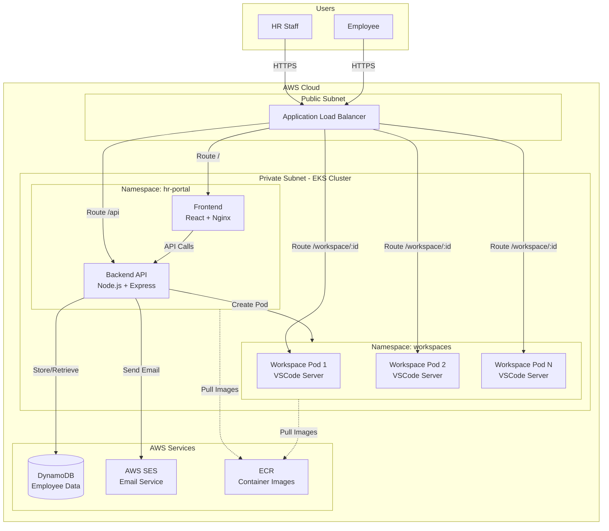
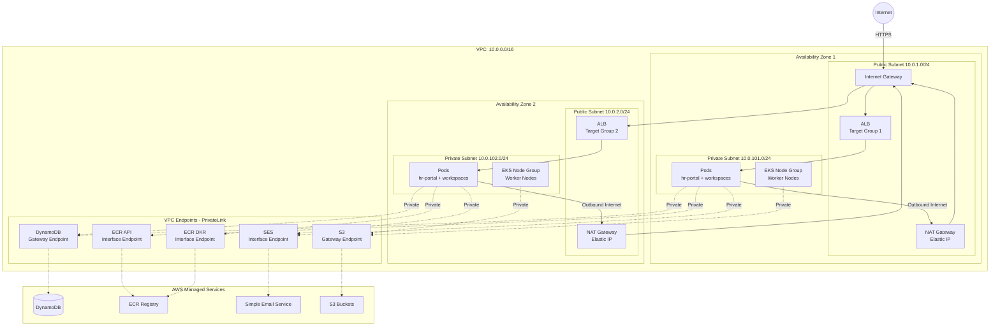
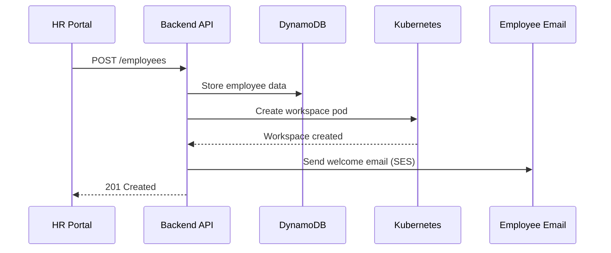

# Architecture

## System Architecture

---

## AWS Network Architecture

---

## Data Flow

---

## Infrastructure

- **VPC**: Public/private subnets across 2 availability zones
- **EKS Cluster**: Kubernetes v1.28+ with managed node groups
- **DynamoDB**: EmployeeLifecycle table with partition key (employeeId)
- **ECR**: 3 repositories (hr-frontend, hr-backend, workspace-vscode)
- **Load Balancer**: AWS ALB with internet-facing listener
- **EBS CSI Driver**: Persistent storage for workspace files
- **IAM Roles**: EKS cluster role, node group role, workspace service account

---

## Applications

- **HR Portal**: React frontend (nginx) for employee management
- **Backend API**: Node.js Express API with AWS SDK integration
- **Workspace**: VSCode server in isolated Kubernetes namespace per employee

---

## Security

- Backend runs in private subnets (no direct internet access)
- Workspaces isolated via Kubernetes namespaces and network policies
- IAM roles for service-to-service authentication
- HTTPS only via Load Balancer SSL termination

---

## Scalability

- EKS autoscaling for node capacity
- Kubernetes HPA for backend pods
- DynamoDB on-demand capacity mode

---

## Deployment

- Terraform provisions AWS infrastructure (VPC, EKS, DynamoDB, IAM)
- Kubectl deploys Kubernetes manifests (deployments, services, ingress)
- ECR stores container images built from Dockerfiles